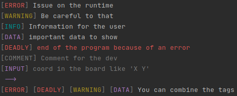

# console message tag
*java compatibility*
### Preview

--- 

## How to use it 

put `Text.kt` in your project 
and look at `DemoMain.kt` for the syntax

in java `System.out.println(TextKt.warning("hello java"));`